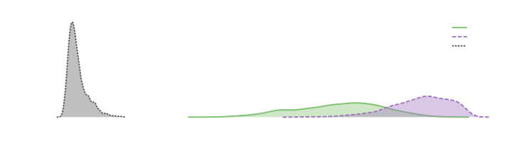
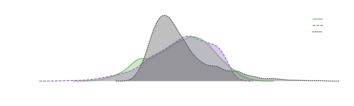
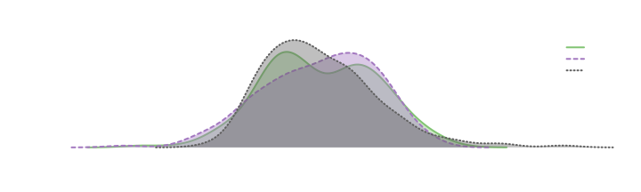
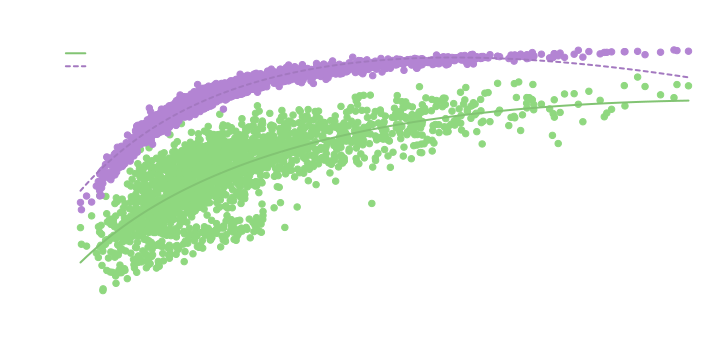
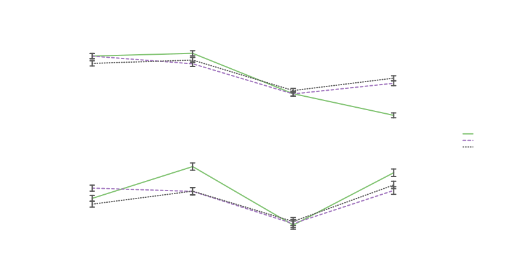
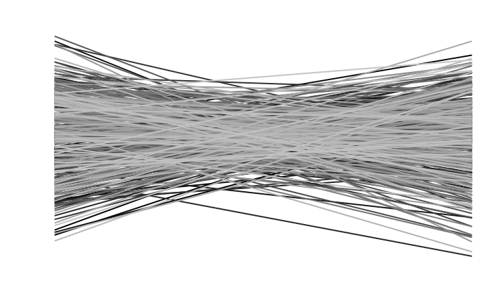
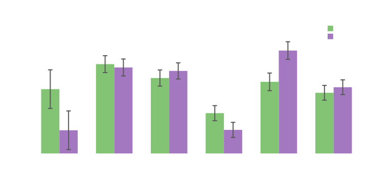
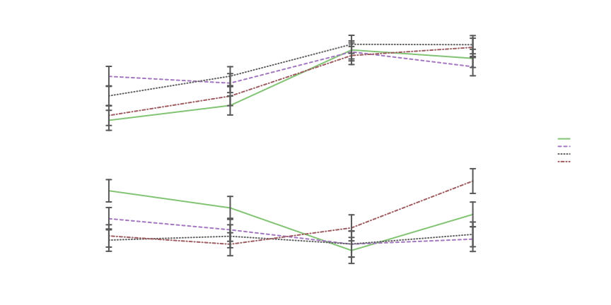

# Exploring Data with splot

This example looks at a few different results from a set of studies:
[osf.io/963gp](https://osf.io/963gp/).

*Built with R 4.5.3*

------------------------------------------------------------------------

## Setting up

First, be sure splot is loaded:

``` r
library(splot)
```

You can read in the data directly from OSF:

``` r
data <- read.csv("https://osf.io/download/crgkn")
```

Or download the file from [osf.io/crgkn](https://osf.io/crgkn).

Then have a look at the data. These are participant and condition
related variables, which will be particularly useful for splitting:

``` r
data[493:502, c(1:3, 80:82)]
#>     reply Study ParticipantID     Style       Topic  Label
#> 493 First     3    3704301285  Feminine Life Course Female
#> 494 First     3    7482037219 Masculine  Relational   Male
#> 495 First     3    1035132554 Masculine  Relational   Male
#> 496 First     3    8764748766  Feminine  Relational   Male
#> 497 First     3    7422386495  Feminine Life Course Female
#> 498 First     3    8875594201  Feminine Life Course   Male
#> 499 First     3    5473944690  Feminine Life Course Female
#> 500 First     3    3828484938  Feminine  Relational   Male
#> 501 First     3    5862456995  Feminine  Relational   Male
#> 502 First     3    6159447371  Feminine  Relational   Male
```

------------------------------------------------------------------------

## Calculating Language Style Matching

Each of these studies had participants reading a prompt and writing
advice in response. The language from both the prompts and responses
were analyzed with the Linguistic Inquiry and Word Count
([LIWC](https://www.liwc.app/)) program, which categorizes words based
on its dictionary. Using these categories, we can look at forms of
language style matching—how similar participants’ reply is to the prompt
they read.

First, the prompts and their LIWC categories are included in a separate
file:

``` r
prompts <- read.csv("https://osf.io/download/xm6ew")
```

Each of the strings in prompts’ `Type` variable corresponds to the
topic, style, and study of each participant’s reply. We want to compare
the language style of each prompt to its replies, so we’ll make a Type
variable to match in data:

``` r
data$Type <- with(data, paste0(
  ifelse(Topic == "Relational", "R", "LC"),
  ifelse(Style == "Feminine", "F", "M"),
  Study
))
```

Now we can actually calculate Language Style Matching (LSM). A Standard
LSM calculation (from [Gonzales, Hancock, & Pennebaker,
2009](https://pdfs.semanticscholar.org/8dc8/df95e36cc9e37f87410a4309a3ee62b965bf.pdf))
uses 9 LIWC function word categories. We’ll save these names to easily
identify them in each dataset:

``` r
cats <- c(
  "ppron", "ipron", "article", "adverb", "conj", "prep", "auxverb", "negate", "quant"
)
```

This form of LSM uses inversed Canberra distance as a measure of
similarity, but there are many similarity metrics, so we might compare a
few:

``` r
# name the metrics we want to calculate.
metrics <- c("canberra", "cosine", "euclidean")

# make empty columns for each in the dataset.
data[, metrics] <- NA

# then loop through each condition.
for (c in unique(data$Type)) {
  # pull in the prompt for the given condition.
  comp <- prompts[prompts$Type == c, cats]

  # identify the subset of data replying to this prompt.
  su <- data$Type == c

  # then perform each calculation between each row in data and the prompt.
  data[su, metrics] <- t(apply(data[su, cats], 1, function(r) {
    c(
      sum(1 - abs(r - comp) / (r + comp + .0001)) / length(r),
      sum(r * comp) / sqrt(sum(r^2 * sum(comp^2))),
      1 / (1 + sqrt(sum((r - comp)^2)))
    )
  }))
}
```

Alternatively, you can use the lingmatch package to perform these
calculations more efficiently:

``` r
library(lingmatch)
metrics <- c("canberra", "cosine", "euclidean")
data[, metrics] <- lingmatch(
  data, prompts,
  group = Type, metric = "all", type = "lsm"
)$sim[, metrics]
```

------------------------------------------------------------------------

## Looking at Language Style Matching

First, we can look at distributions in a few different ways:

``` r
splot(data[, metrics])
```



``` r
# mv.scale z-scores multiple y variables to make them easier to compare.
splot(data[, metrics], mv.scale = T)
```



``` r
# su subsets the dataset to show only replies to the
# masculine relational prompt in Study 4.
splot(data[, metrics], data, Type == "RM4", mv.scale = T)
```



The different similarity metrics we calculated a pretty highly
correlated:

``` r
cor(data[, metrics])
#>            canberra    cosine euclidean
#> canberra  1.0000000 0.7823261 0.7463881
#> cosine    0.7823261 1.0000000 0.8556146
#> euclidean 0.7463881 0.8556146 1.0000000
```

But their relationship is not quite linear:

``` r
# cbind (or list) is another way to enter multiple y variables.
# when a transformed version of the x variable is added,
# it is used to adjust the prediction line.
splot(cbind(canberra, cosine) ~ euclidean + log(euclidean), data)
```



They also vary differently between prompts and studies:

``` r
splot(data[, metrics] ~ prompt, data, Study > 2, between = Study, mv.scale = T)
```



In Studies 3 and 4, each participant replied to two prompts, so we can
look at changes in their matching from one prompt to another (it looks
pretty random, which is generally what we want):

``` r
# turning ParticipantID into characters or setting lim to FALSE
# will prevent it from being split.
# other aspects are just cosmetic;
#  line.type affects the appearance of the lines,
#  and mxl spreads the x labels a little more.
splot(
  canberra ~ reply * as.character(ParticipantID), data, Study == 4,
  line.type = "l", mxl = c(1, 2)
)
```



------------------------------------------------------------------------

## Person Perception Ratings

After writing advice to the authors of each prompt, participants also
completed ratings of the text and author.

One potentially interesting rating was of relative socioeconomic status
(`relativeSes`; “Relative to your own, where would you place the
author’s socioeconomic status?”; -3 to 3).

``` r
# make a new variable to look at Study and Topic without Style.
Study_and_Topic <- with(data, paste0("S", Study, " ", Topic))

splot(relativeSes ~ Study_and_Topic * as.factor(Style), data, type = "bar")
```



A difference between styles doesn’t appear in each topic, but when it
does, the incongruent style is rated as lower in status than the
congruent style (considering relational to be a feminine topic, and life
course to be a masculine topic).

The inconsistency between prompts may be explained by setting; the first
two life course prompts were largely job related, and the relational
topics were not. The prompts in Study 4 set out to reverse this, with
the relational topic set in a workplace, and the life course topic at
least not directly related to a job.

It can sometimes help to look at the same pattern a different way, and
compare it to that of other variables:

``` r
# levels reorders the prompt variable to make the trends a little easier to see.
splot(
  cbind(TextQuality, Behavioral, pp_like, relativeSes) ~ prompt, data,
  between = Study,
  mv.scale = T, levels = list(prompt = c(4, 2, 1, 3))
)
```



In Study 3, each of the perception related variables seem to hang
together for the most part, with ratings of the text (`TextQuality`),
ratings of the author (`relativeSes`), and disposition toward the author
(`pp_like` and `Behavioral`) all generally increasing from the masculine
relational prompt to the masculine life course prompt. In contrast, in
Study 4 only the SES rating remains similar, with liking staying the
same between prompts, and text and quasi-behavioral ratings generally
decreasing from the masculine relational to the masculine life course
prompt.

Aside from being set it a workplace, the relational prompts in Study 4
also differed from the previous relational prompts in that their content
was somewhat more striking (concerning a coworker’s potential abuse of
their autistic child). This may have influenced the perception of text
quality in particular, as that appears to be the most aberrant of the
perception ratings for those topics.

These are, of course, loose interpretations, but more exploration of the
data may offer clearer pictures.
