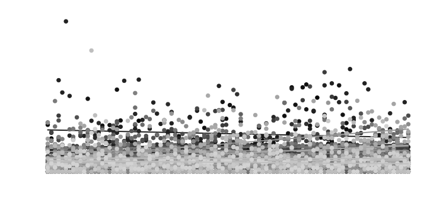
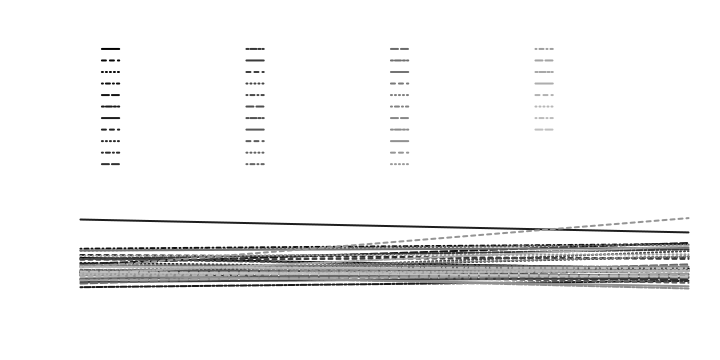
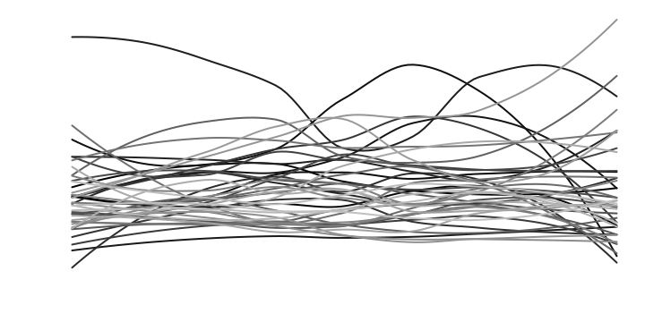
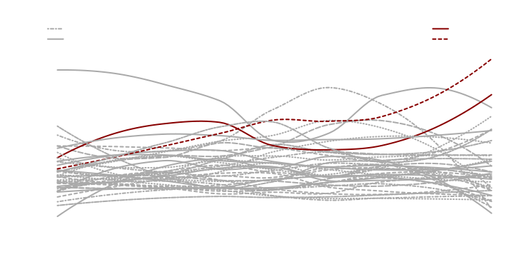
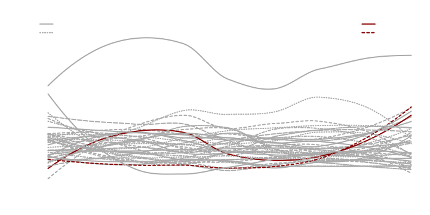
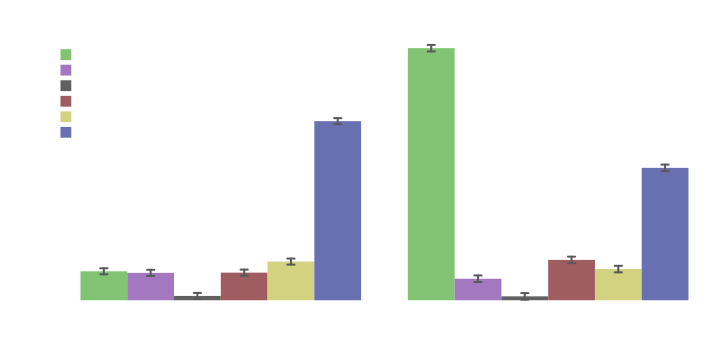
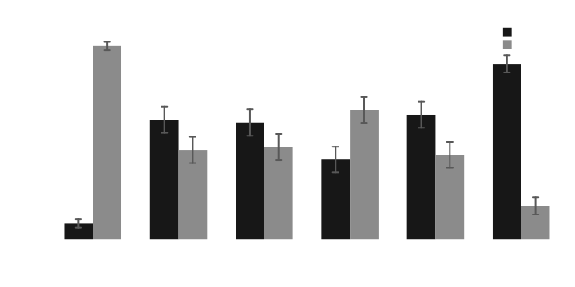

# Preparing a Particular Result with splot

This example tweaks a few results to prepare them for publication or
whatever, using the dataset from a project comparing autobiographies:
[osf.io/vwq9p](https://osf.io/vwq9p/).

*Built with R 4.5.3*

------------------------------------------------------------------------

## Setting up

First, be sure splot is loaded:

``` r
library(splot)
```

Then load in the data and attach it (can take a little while):

``` r
data <- read.csv("https://osf.io/ey9hs/?action=download", fileEncoding = "ISO-8859-1")
attach(data)
```

------------------------------------------------------------------------

## Anger Word Usage

Texts are split into 100 segments each (the `index` variable), and are
identified by author (the `name` variable).

To look at a particular category across segments of text, we can just
plot the category against `index`, with `name` in the `by` position:

``` r
splot(anger ~ index * name)
```



Quite messy, and the legend is not drawn automatically when there are so
many levels of `by`.

We could add an arranged legend, and get rid of points to clean things
up a bit:

``` r
# lpos positions, ncol changes the number of columns, and
# cex['leg'] changes the font size of the legend.
splot(anger ~ index * name, lpos = "top", ncol = 4, cex = c(leg = .8), points = FALSE)
```



With this many levels of `by`, the legend isn’t very useful, so we might
just keep it off.

We’re also interested in non-linear trends over the course of each text,
so we’ll switch to loess lines, and we’ll use `myl` to zoom in (restrict
the range) a bit:

``` r
splot(anger ~ index * name, points = FALSE, lines = loess, myl = c(-.05, 1.7))
```



Prettier at least, but still not very informative.

This project was mostly interested in the Rodger text—how it relates to
the Hitler text, and how both of those relate to other autobiographies.
As such, it would be nice to know which lines are the Rodger and Hitler
texts, and which are (in this case) the highest comparison texts.

To do this, we’ll first have to set up line types and colors outside of
splot:

``` r
ns <- unique(data$name)
nl <- length(ns)
disp <- data.frame(name = ns, lty = rep_len(1:9, nl))
disp$col <- ifelse(grepl("Hit|Rod", disp$name), "#880101", "#aaaaaa")
disp$lty[grepl("Hit|Rod", disp$name)] <- 1:2

# now we have an object with names associated with line types (lty) and colors (col):
disp[1:10, ]
#>                   name lty     col
#> 1          Henry Adams   1 #aaaaaa
#> 2  Elizabeth von Arnim   2 #aaaaaa
#> 3      Margot  Asquith   3 #aaaaaa
#> 4       Clifford Beers   4 #aaaaaa
#> 5         Annie Besant   5 #aaaaaa
#> 6          George Airy   6 #aaaaaa
#> 7           Black Hawk   7 #aaaaaa
#> 8         William Cody   8 #aaaaaa
#> 9           Henry Coke   9 #aaaaaa
#> 10       Joseph Conrad   1 #aaaaaa
```

Now within splot (using the `add` argument), we can always mark the
Rodger and Hitler text, and dynamically display a set of comparison
texts.

Here, the `mnc` part is calculating the mean of each text across
segments, then sorting names by their mean and pulling the highest 2.
The lowest 2 could be pulled by changing the `TRUE` to `FALSE`.

In the first `legend` call, the constants are position (set in the first
argument), and line weight (`lwd`) and box type (`bty`; `'n'` for none).
Dynamic arguments are pulled from the `disp` object we created before,
based on the names in `mnc`.

``` r
splot(anger ~ index * name,
  points = FALSE, lines = "loess", myl = c(0, 2.2), colors = disp$col, lty = disp$lty,
  add = {
    mnc <- names(sort(
      colMeans(sapply(cdat$`.^^.`, "[[", "y"))[-grep("Hit|Rod", names(cdat$`.^^.`))],
      TRUE
    )[1:2])
    legend("topleft", sort(mnc),
      lty = disp[disp$name %in% mnc, 2], col = disp[disp$name %in% mnc, 3],
      lwd = 2, bty = "n"
    )
    legend(
      "topright", c("Adolf Hitler", "Elliot Rodger"),
      lty = 1:2, col = disp$col[grep("Hit|Rod", disp$name)], lwd = 2, bty = "n"
    )
  }
)
```



If we were planning on applying these settings to several graphs (if,
say, we wanted to look at several different `y` variables individually),
we could add the consistent stuff to an options list:

``` r
# quote() prevents things from being evaluated outside of the function.
opt <- list(
  points = FALSE,
  lines = "loess",
  colors = disp$col,
  lty = disp$lty,
  add = quote({
    mnc <- names(sort(colMeans(sapply(cdat$`.^^.`, "[[", "y"))[-grep(
      "Hit|Rod",
      names(cdat$`.^^.`)
    )], TRUE)[1:2])
    legend("topleft", sort(mnc),
      lty = disp[disp$name %in% mnc, 2], col = disp[disp$name %in% mnc, 3],
      lwd = 2, bty = "n"
    )
    legend("topright", c("Adolf Hitler", "Elliot Rodger"),
      lty = 1:2,
      col = disp$col[grep("Hit|Rod", disp$name)], lwd = 2, bty = "n"
    )
  })
)
```

This can save some room at least:

``` r
splot(death ~ index * name, myl = c(0, 1.35), options = opt)
```



------------------------------------------------------------------------

## Comparison of Pronoun Usage

We might want to look at a few variables at the same time. In this
dataset, the difference in pronoun use between the Rodger and Hitler
text is interesting, so we’ll look at personal pronouns
(`i, we, you, shehe, they`) and impersonal pronouns (`ipron`) all
together:

``` r
splot(
  cbind(i, we, you, shehe, they, ipron) ~ name,
  type = "bar", su = grepl("Hit|Rod", name)
)
```



To better compare each variable between texts, we can put the variables
on the x axis with `mv.as.x=TRUE`, and z-score with `mv.scale=TRUE` to
standardize ranges.

While we’re at it, we’ll also pretty things up with better axis titles,
and by removing the subset message (which can be done with `sub=FALSE`
or just by subsetting the data), and changing colors and legend
position:

``` r
splot(
  cbind(i, we, you, shehe, they, ipron) ~ name,
  type = "bar", mv.as.x = TRUE, mv.scale = TRUE,
  data = data[grep("Hit|Rod", data$name), ], title = "Pronoun Usage between Texts",
  laby = "Pronouns (z-scored)", labx = "Category", colors = "grey", leg.title = FALSE
)
```



------------------------------------------------------------------------

## Saving Figures

Now that we have some formatted figures, we might want to use them in
other things.

When it comes to rendering, two factors make for the nicest looking
figures: anti-aliasing (making lines less pixelated) and scalability
(they won’t become pixelated when zoomed in on; a feature of
vector-based formats like pdf, svg, and emf). Using vector-based formats
means you can preserve the scale of a plot without losing quality; that
is, if you want larger text and more compact elements, you can adjust
your plot window and rerender the plot until the proportions look right.
Even if the window is very small, you can blow the vector based image up
to any size.

The default format when saving from within splot (`save=TRUE`) is pdf
(using `cairo_pdf`). If you’re using RStudio, you can save the same
quality of pdf from the Export dropdown.

svg is generally the best format for anti-aliased, scalable images
(`format=svg`). These can be included in newer versions of Word and
PowerPoint, and are editable in [Inkscape](https://inkscape.org) among
other things (even text editors!).

For older versions of Word and PowerPoint, emfs can be used instead of
svgs. To save as anti-aliased emfs, you can install and load the
`devEMF` package (`install.packages('devEMF'); library('devEMF')`), then
add `format=emf` to the plot you want to save.
