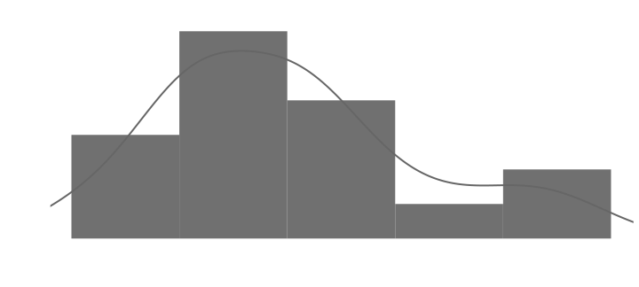
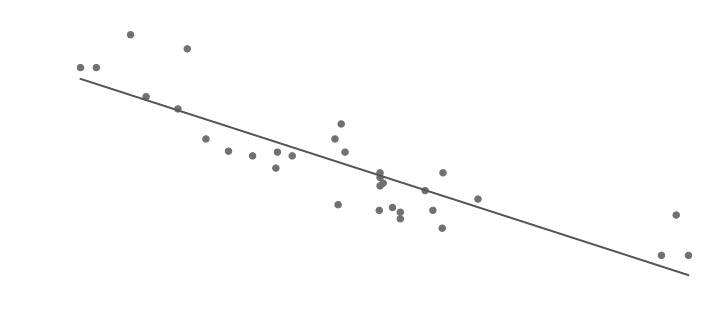
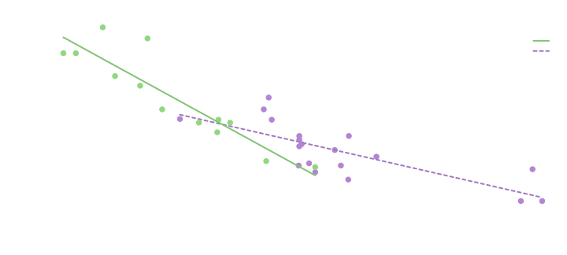
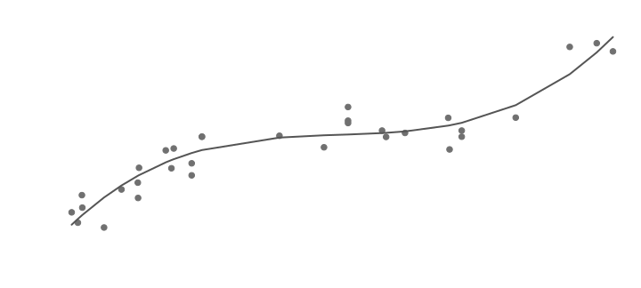
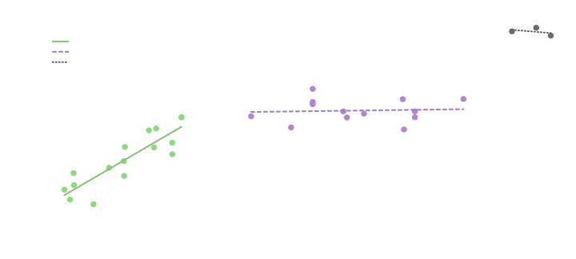
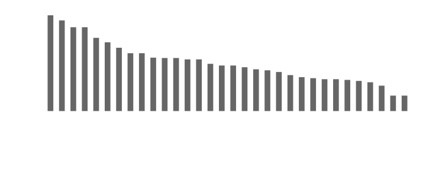
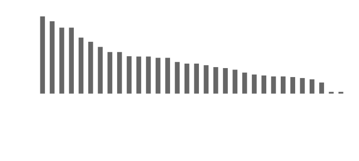
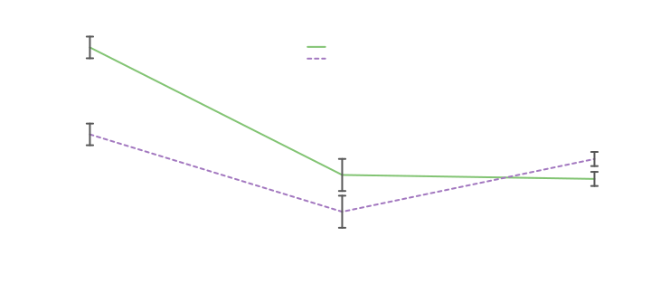
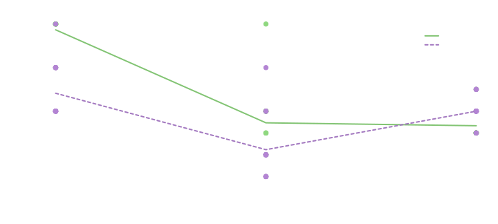

# Introduction to R and splot

*Built with R 4.5.3*

------------------------------------------------------------------------

**R** is a programming language and software environment with a focus on
statistics.  
**Splot** is an R package for visualizing data.  
This guide will introduce you to both.

## Setting up

### Downloading R

Follow the link matching your system to download R:  
[Windows](https://cloud.r-project.org/bin/windows/base/) \|
[Mac](https://cloud.r-project.org/bin/macosx/) \|
[Linux](https://cloud.r-project.org/bin/linux/)

In Windows, you may see two versions, starting with R i386 and R x64.
These correspond to the 32 and 64 bit versions of R. The 64 bit version
should be fine on most modern systems, but if you run into issues, you
might try the 32 bit version.

### Installing packages

Packages offer additional functionality beyond base R, usually to make
certain processes easier.

The initial download of R includes a few base packages, but there are
many packages available through the Comprehensive R Archive Network
(CRAN).

Packages can be downloaded and installed from within R using the
`install.packages` function. For example, this will install splot:

``` r
install.packages("splot")
```

The first time you install packages, you’ll need to select a mirror.
These are CRAN hosts—they have the same files, but are in different
physical locations. Choose a mirror that is geographically close to you
for the best download speeds. If a package fails to download, try
changing mirrors.

### Loading packages

Each time you start R, packages that aren’t part of base R need to be
loaded using the `library` function. For example:

``` r
library("splot")
```

------------------------------------------------------------------------

## Understanding R

### The underlying system

**The interpreter**. When you enter commands into the console, the
interpreter tries to understand it. You might think of this
understanding in terms of functions (operators) and data (operands). For
example, if you enter `1 + 1` into the console, R will understand that
each `1` is a number, and the `+` is a function.

**Functions**. Almost everything in R is a function. Most functions are
called by the `(` function; the name of the function followed by
parentheses (e.g., [`sum()`](https://rdrr.io/r/base/sum.html)). Many
functions accepts *arguments*—data entered inside the parentheses,
separated by commas. For example, `sum(1, 2)` is a call to the `sum`
function, with `1` as the first argument, and `2` as the second
argument. The `+` function works on its own, but it can also be called
by the `(` function: `1 + 1` is the same as `'+'(1, 1)`.

Most functions will output some form of data (in `+`’s case, the output
is a single numeric value). This means that functions can be entered as
arguments to other function. For example, `sum(sum(1, 1), 2)` is another
call to the `sum` function, with the output of `sum(1, 1)` as the first
argument, and `2` as the second argument.

### Data representations

In what follows, the outlined code boxes contain syntax highlighted code
which you can run in an R console, followed by its expected output
(preceded by `#>`).

#### Matrices

Matrices store sets of data. For example, take a look at the Motor Trend
dataset, which is include in base R:

``` r
mtcars
#>                      mpg cyl  disp  hp drat    wt  qsec vs am gear carb
#> Mazda RX4           21.0   6 160.0 110 3.90 2.620 16.46  0  1    4    4
#> Mazda RX4 Wag       21.0   6 160.0 110 3.90 2.875 17.02  0  1    4    4
#> Datsun 710          22.8   4 108.0  93 3.85 2.320 18.61  1  1    4    1
#> Hornet 4 Drive      21.4   6 258.0 110 3.08 3.215 19.44  1  0    3    1
#> Hornet Sportabout   18.7   8 360.0 175 3.15 3.440 17.02  0  0    3    2
#> Valiant             18.1   6 225.0 105 2.76 3.460 20.22  1  0    3    1
#> Duster 360          14.3   8 360.0 245 3.21 3.570 15.84  0  0    3    4
#> Merc 240D           24.4   4 146.7  62 3.69 3.190 20.00  1  0    4    2
#> Merc 230            22.8   4 140.8  95 3.92 3.150 22.90  1  0    4    2
#> Merc 280            19.2   6 167.6 123 3.92 3.440 18.30  1  0    4    4
#> Merc 280C           17.8   6 167.6 123 3.92 3.440 18.90  1  0    4    4
#> Merc 450SE          16.4   8 275.8 180 3.07 4.070 17.40  0  0    3    3
#> Merc 450SL          17.3   8 275.8 180 3.07 3.730 17.60  0  0    3    3
#> Merc 450SLC         15.2   8 275.8 180 3.07 3.780 18.00  0  0    3    3
#> Cadillac Fleetwood  10.4   8 472.0 205 2.93 5.250 17.98  0  0    3    4
#> Lincoln Continental 10.4   8 460.0 215 3.00 5.424 17.82  0  0    3    4
#> Chrysler Imperial   14.7   8 440.0 230 3.23 5.345 17.42  0  0    3    4
#> Fiat 128            32.4   4  78.7  66 4.08 2.200 19.47  1  1    4    1
#> Honda Civic         30.4   4  75.7  52 4.93 1.615 18.52  1  1    4    2
#> Toyota Corolla      33.9   4  71.1  65 4.22 1.835 19.90  1  1    4    1
#> Toyota Corona       21.5   4 120.1  97 3.70 2.465 20.01  1  0    3    1
#> Dodge Challenger    15.5   8 318.0 150 2.76 3.520 16.87  0  0    3    2
#> AMC Javelin         15.2   8 304.0 150 3.15 3.435 17.30  0  0    3    2
#> Camaro Z28          13.3   8 350.0 245 3.73 3.840 15.41  0  0    3    4
#> Pontiac Firebird    19.2   8 400.0 175 3.08 3.845 17.05  0  0    3    2
#> Fiat X1-9           27.3   4  79.0  66 4.08 1.935 18.90  1  1    4    1
#> Porsche 914-2       26.0   4 120.3  91 4.43 2.140 16.70  0  1    5    2
#> Lotus Europa        30.4   4  95.1 113 3.77 1.513 16.90  1  1    5    2
#> Ford Pantera L      15.8   8 351.0 264 4.22 3.170 14.50  0  1    5    4
#> Ferrari Dino        19.7   6 145.0 175 3.62 2.770 15.50  0  1    5    6
#> Maserati Bora       15.0   8 301.0 335 3.54 3.570 14.60  0  1    5    8
#> Volvo 142E          21.4   4 121.0 109 4.11 2.780 18.60  1  1    4    2
```

In the `mtcars` matrix, each row represents a particular car, and each
column represents a feature of that car (a variable). You can use the
`?` function ([`?mtcars`](https://rdrr.io/r/datasets/mtcars.html)) to
access documentation.

Note: In base R, there are purely numerical matrices (as made with the
`matrix` function) and matrices with mixed data types (such as numerical
and character or factor columns; as made by the `data.frame` function).
These are both matrix representations, but they have some different
methods (functions that interact with them). `mtcars` is a `data.frame`
object (which you can see with the `class` function; `class(mtcars)`),
but the methods used in these examples (such as the `[` function) will
also work with standard `matrix` objects.

#### Matrices as arguments

Some functions accept entire matrices as arguments. For example, the
`colnames` function will output a matrix’s column names:

``` r
colnames(mtcars)
#>  [1] "mpg"  "cyl"  "disp" "hp"   "drat" "wt"   "qsec" "vs"   "am"   "gear"
#> [11] "carb"
```

#### Vectors as arguments

Other functions only accept values or vectors (single columns or rows,
or created independently with the `c` function) as arguments. You can
use the `[` function to select single columns or rows by name or index.
`[`’s first argument selects rows, and its second argument selects
columns. For example, you can select the `mpg` variable like this (note
that variable names are case sensitive):

``` r
mtcars[, "mpg"]
#>  [1] 21.0 21.0 22.8 21.4 18.7 18.1 14.3 24.4 22.8 19.2 17.8 16.4 17.3 15.2 10.4
#> [16] 10.4 14.7 32.4 30.4 33.9 21.5 15.5 15.2 13.3 19.2 27.3 26.0 30.4 15.8 19.7
#> [31] 15.0 21.4
```

Fun note: The `[` function can also be called by the `(` function:
`'['(mtcars,, 'mpg')`.

Since the `[` function outputs a vector, you can enter it as an argument
to another function, such as the `sum` function:

``` r
sum(mtcars[, "mpg"])
#> [1] 642.9
```

The `sum` function will handle multiple vectors or single values entered
as individual arguments (`sum(c(1, 2, 3))` is the same as
`sum(1, 2, 3)`), but other functions expect a vector as the first
argument. For instance `mean(c(1, 2, 3))` gives the average of 1, 2, and
3, whereas `mean(1, 2, 3)` would be the same as `mean(1)`, giving the
average of 1. Check a function’s documentation to see what it
expects—`sum`’s first argument is `...` meaning it will collapse
additional arguments (those without names matching other arguments) into
the first argument, whereas `mean`’s first argument is `x`.

## Visualizing data with splot

The `splot` function generates all sorts of plots. Its first argument is
for variable names, and its second argument is for the dataset
containing those variables. See the documentation for more information
about the `splot` function (enter
[`?splot`](https://miserman.github.io/splot/reference/splot.md) in an R
console, or [view
online](https://miserman.github.io/splot/reference/splot.html)).

### Distribution of a single variable

For example, we can look at the density distribution (and histogram) of
the `mpg` variable in `mtcars` like this:

``` r
splot(mpg, mtcars)
```



Here, the bars depict the frequency of the value-range they cover (which
is the histogram part), and the line is the estimated theoretical
distribution of the variable (if more cars were sampled from the same
source, they would theoretically resemble this distribution; e.g., most
cars would go between 15 and 20 miles per gallon).

### Relationship between two variables

The first argument in the `splot` function can be entered as a formula,
which is a way to specify relationships between variables. The first
part of a formula is the tilde (`~`), which separates a `y` variable
(before the tilde; on the vertical axis of a plot) from an `x` variable
(after the tilde; on the horizontal axis of a plot).

For example, we can look at the relationship between the `mpg` and `wt`
variables like this:

``` r
splot(mpg ~ wt, mtcars)
```



Each dot represents a car, and its position is a combination of its
miles per gallon (MPG) and weight; the higher it is vertically, the more
miles it can go per gallon of gas, and the farther it is horizontally,
the more it weighs (in tons).

The line is from a linear regression, which is attempting to predict y
given x. For example, from this data, if the regression were to see a
car that weighed about 3 tons, it would predict its MPG to be around 22.

Something we might do to improve this prediction (model fit) is to
consider other variables. Weight seems to be closely related to MPG
(going by the last plot), but maybe MPG depends on something else as
well, such as the car’s style of transmission (automatic versus manual).
To look at this, we can add a splitting variable to the formula with an
asterisk (`*`).

Splitting variables break the data up into groups based on their value.
For example, this will separate cars that have an automatic transmission
(0) from those that have a manual transmission (1), and estimate a line
for each group.

``` r
splot(mpg ~ wt * am, mtcars)
```



From this, it seems (in this sample of cars at least) that the negative
relationship between weight and MPG is stronger among cars with a manual
transmission; transmission appears to moderate the relationship between
weight and MPG. That is, the line for cars with manual transmissions has
a steeper slope than the line for cars with automatic transmissions.

Another way we can improve model fit is by allowing our prediction lines
to bend. A particularly clear case where this seems to help is in
modeling the relationship between weight and displacement:

``` r
splot(wt ~ disp + disp^2 + disp^3, mtcars)
```



The `^` function raises the preceding vector by the following value, so
`disp ^ 2` is the squared `disp` variable, and `disp ^ 3` is the cubed
`disp` variable. Each of these transformations of `x` increases the
prediction line’s ability to bend.

Maybe the relationship between displacement and weight is actually curvy
like this, but we might suspect there are just different types of cars
represented here. For example, it kind of looks like there are clusters
in the data, one under 200, and one between 200 and 400. We can
visualize this by splitting displacement by itself at those points:

``` r
splot(wt ~ disp * disp, mtcars, split = c(200, 400))
```



This cleans up the data nicely, but if we wanted to say these clusters
actually represent different types of cars, it would be more convincing
if we could find another variable that defines groups like these.

### Categorical variables

We started by looking at the `mpg` variable by itself, but since this
dataset has named entries (unlike sets with less meaningful rows like
participant IDs), it might be informative to visualize the MPG of each
entry:

``` r
splot(mpg ~ rownames(mtcars), mtcars, type = "bar", sort = TRUE)
```



Here, the additional arguments are changing aspects of the display from
the way they would show up by default: The `type` argument sets the look
of the data (bars rather than lines or points), and the `sort` argument
changes the way the `x` variable is ordered (by `y`’s value rather than
alphabetically).

The `splot` function has many more arguments which mostly affect the way
each element of the figure is displayed. For example, in this figure,
you might want to adjust the range of the y axis (with the `myl`
argument), and maybe make the labels more informative (with the `laby`
and `labx` arguments):

``` r
splot(
  mpg ~ rownames(mtcars), mtcars,
  type = "bar", sort = TRUE,
  myl = c(10, 35), laby = "Miles Per Gallon", labx = "Car"
)
```



To explore the data more broadly we might look at a few variables as
once. These can be entered as a matrix in the y position:

``` r
splot(mtcars[, c("cyl", "carb", "gear")] ~ mpg, mtcars, mv.as.x = TRUE)
```



The `mv.as.x` argument is saying the columns of `y` should be displayed
as levels on the x axis (“mv” stands for “multiple variables”).
Otherwise, they would be displayed as levels of a by variable, with MPG
on the x axis.

This type of plot is more commonly displayed as a bar plot, because
lines are sometimes taken to imply that there’s some movement between
levels (as in the same participants experiencing different conditions;
within-person experimental designs).

Another way to interpret lines, however, is as regression lines. This is
particularly clear if we look at the raw data by representing this line
plot as a scatter plot:

``` r
splot(
  mtcars[, c("cyl", "carb", "gear")] ~ mpg, mtcars,
  mv.as.x = TRUE, type = "scatter", xlas = 1, lpos = "topright"
)
```



The `xlas` argument sets the orientation of the x axis labels (since
they default to vertical for scatter plots), and the `lpos` argument
sets the position of the legend.

This representation isn’t very informative in terms of the data (as
there is a lot of overlap at each level of each variable), but these
lines are actually prediction lines from regressions. The line plot
depicts each part of the regression: Where each line crosses an x axis
label is the mean of the data represented by the line within that level;
the error bars show the standard errors around those means (which
correspond to the p-value of the associated t test; if they cross, the
difference is non-significant); and the slope of the line between levels
corresponds to the associated beta weight. In this sense, a line plot
can be somewhat more informative than a bar plot.

------------------------------------------------------------------------

For more applied examples, see the
[explore](https://miserman.github.io/splot/articles/explore.html) and
[refine](https://miserman.github.io/splot/articles/refine.html)
vignettes.  
For more splot specific information, see the [style
guide](https://miserman.github.io/splot/articles/style.html) and [full
documentation](https://miserman.github.io/splot/reference/splot.html).
